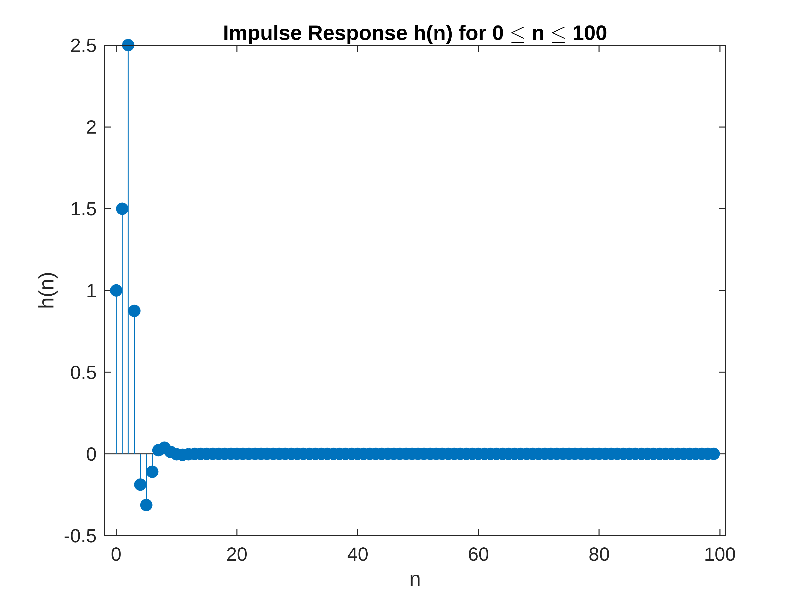
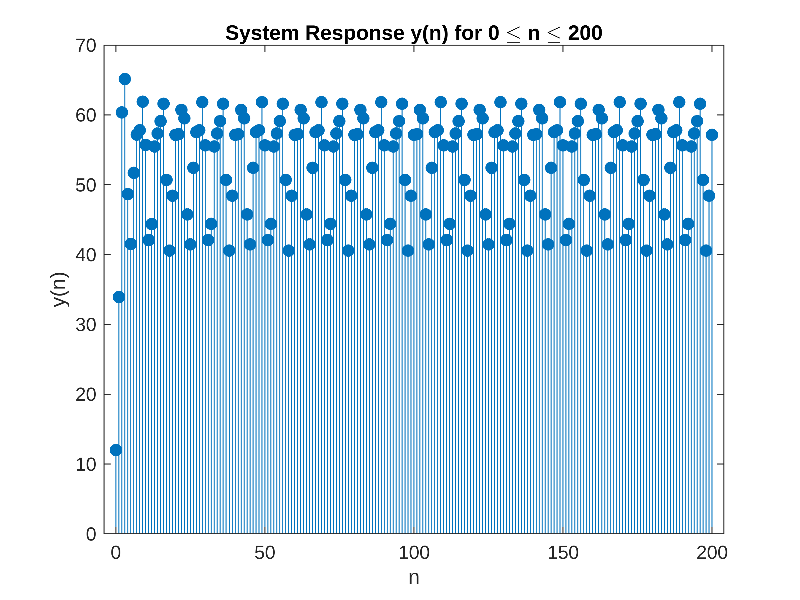
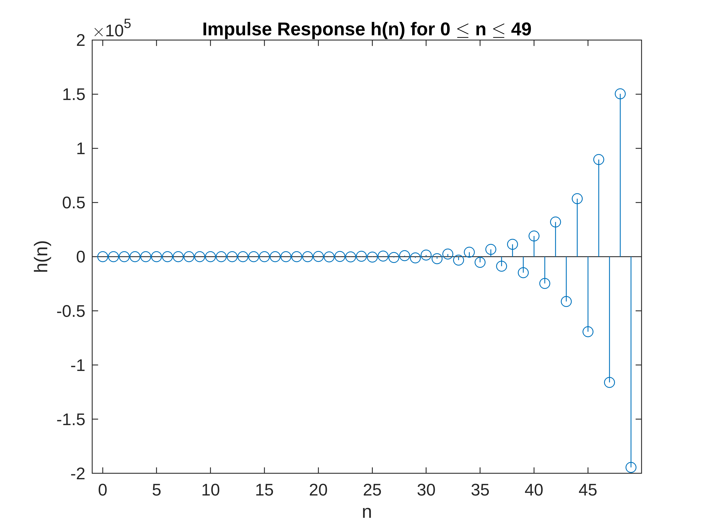
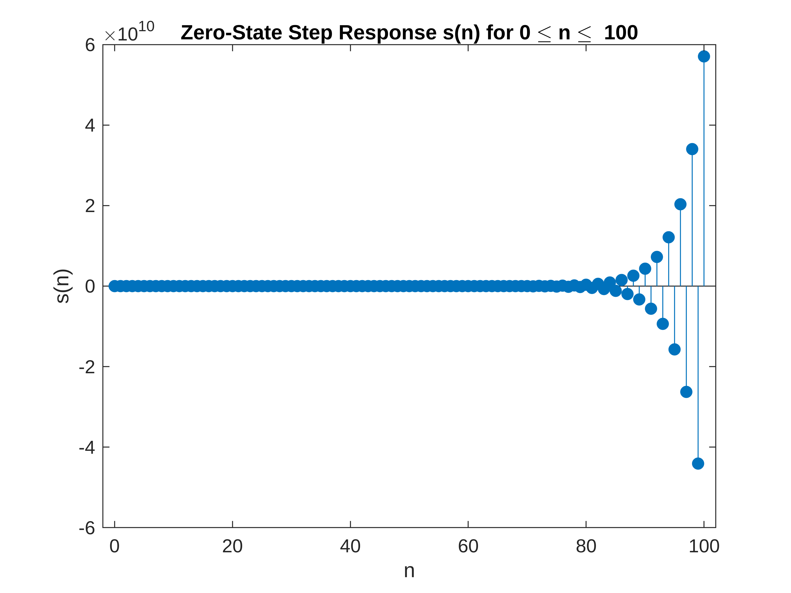
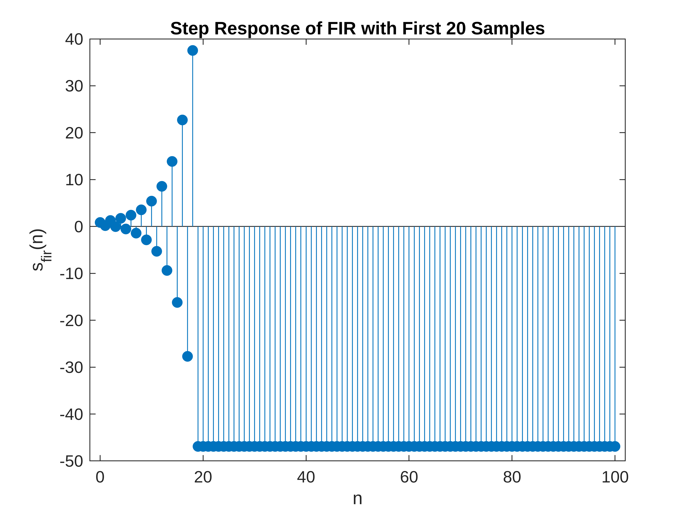

# C2.8
```matlab
clear; clc; close all;

%{
y(n) = (1/2)y(n-1) -(1/4)y(n-2) + x(n) + 2x(n-1) + x(n-3)
a1 = 1/2 , a2 = -1/4, b0 = 1, b1 = 1, b2 = 2
%}

a1 = 1/2;
a2 = -1/4;
b0 = 1;
b1 = 1;
b2 = 2;
N = 100;
h = impz([b0,b1,b2],[1,-a1,-a2],N);

n_h = 0:N-1;
figure(1);
stem(n_h,h,"filled");
xlabel('n'); ylabel('h(n)');
title('Impulse Response h(n) for 0 \leq n \leq 100');
```



```matlab

      
n2 = 0:200;
x = 10 + 2*cos(0.3*pi*n2) + 5*sin(0.6*pi*n2);
y = filter([b0,b1,b2], [1,-a1,-a2], x);

figure(2);
stem(n2, y, "filled");
xlabel('n'); ylabel('y(n)');
title('System Response y(n) for 0 \leq n \leq 200');
```


# C2.14
```matlab
%{
y(n) = -a1y(n-1)-a2y(n-2)+b0x(n)
a1 = -0.8, a2 = 0.64, b0 = 0.866
%}

a1 = -0.8;
a2 = 0.64;
b0 = 0.866;

N=50;
h = impz(b0,[1,-a1,-a2],N);

n_h = 0:N-1;
figure(3);
stem(n_h,h)
xlabel('n');
ylabel('h(n)');
title('Impulse Response h(n) for 0 \leq n \leq 49');
```



```matlab

%=========================================================================================%
N = 101;
x_step = ones(N,1);
% s = filter(b0, [1,-a1,-a2],x_step);
s = stepz(b0,[1,-a1,-a2],N);
n_s = 0:N-1;

figure(4);
stem(n_s, s, 'filled');
xlabel('n'); ylabel('s(n)');
title('Zero-State Step Response s(n) for 0 \leq n \leq  100');
```



```matlab

%==========================================================================================%
h_fir = h(1:20);
s_fir = filter(h_fir, 1, x_step);

figure(5);
stem(n_s, s_fir, 'filled');
xlabel('n'); ylabel('s_{fir}(n)');
title('Step Response of FIR with First 20 Samples');
```



```matlab
%============================================================================================%

```
