# Part A: Getting the Data
```matlab
% clear    % Clear all variables
close all

[music, Fs] = audioread("StayWithMeTrim.wav"); %trimmed manually to 42
music_ch1 = music(:,1);
time = (0:length(music_ch1)-1)/Fs;
figure(1)
plot(time,music_ch1);
xlabel('Time (sec)')
ylabel('Magnitude')
title('Channel 1 Sample rate 44.1 kHz (Nyquist 22.05 kHz) Full Sample')
axis tight
```

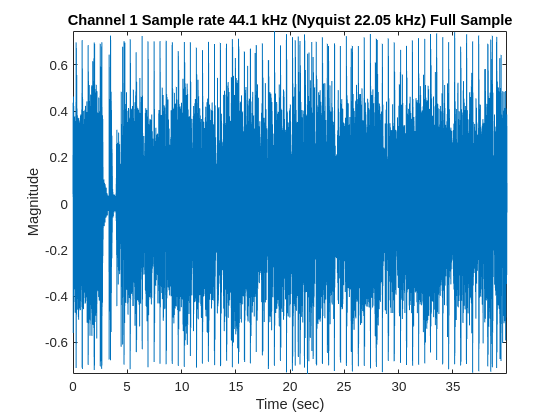

```matlab

figure(2)
%trimming the data to 10s and plotting
music_10s = music_ch1(1:450000);
time_10s = (0:length(music_10s)-1)/Fs;
plot(time_10s,music_10s);
xlabel('Time (sec)');
ylabel('Magnitude');
title('Channel 1 Sample rate 44.1 kHz (Nyquist 22.05 kHz) 10 secs');
axis tight;
```

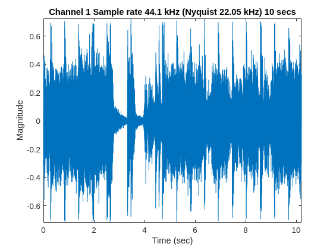
# Part B: Aliasing Experiments, Time\-domain Observations
```matlab
%subsampling by 5
music_by_5 =  music_10s(1:5:end);
Fs_by_5 = Fs/5;
time_by_5 = (0:length(music_by_5)-1)/Fs_by_5;
figure(3)
plot(time_by_5,music_by_5);
xlabel('Time (sec)');
ylabel('Magnitude');
title('Channel 1 Sample rate 8.82 kHz (Nyquist 4.41 kHz)');
axis tight;
```

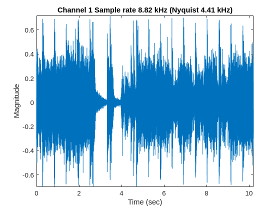

```matlab
% sound(music_by_5, Fs/5)

%subsampling by 15
music_by_15 = music_10s(1:15:end);
Fs_by_15 = Fs/15;
time_by_15 = (0:length(music_by_15)-1)/Fs_by_15;
figure(4)
plot(time_by_15,music_by_15);
xlabel('Time (sec)');
ylabel('Magnitude');
title('Channel 1 Sample rate 2.94 kHz (Nyquist 1.47 kHz)');
axis tight;
```

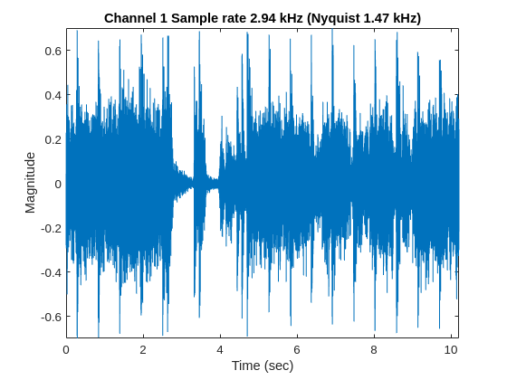

```matlab
% sound(music_by_15, Fs/15)

%subsampling by 25
music_by_25 = music_10s(1:25:end);
Fs_by_25 = Fs/25;
time_by_25 = (0:length(music_by_25)-1)/Fs_by_25;
figure(5)
plot(time_by_25,music_by_25);
xlabel('Time (sec)');
ylabel('Magnitude');
title('Channel 1 Sample rate 1.764 kHz (Nyquist 0.882 kHz)');
axis tight;
```

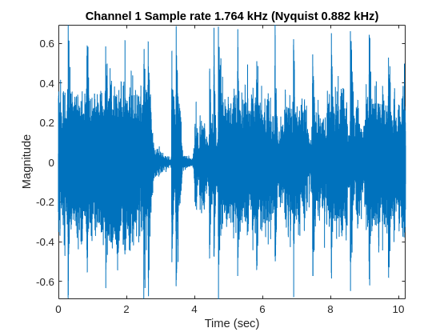

```matlab
% sound(music_by_25, Fs/25)
```
# Part B \-  Aliasing Experiments, Frequency\-domain Observations
```matlab
%original frequency domain plot
nsamp = length(music_ch1); %no of samples in signal
fnyquist = Fs/2;            %nyquist freq
x_mag = abs(fft(music_ch1))/nsamp;  %mag of FT
bins = [0:nsamp-1];
freq_hz = bins*Fs/nsamp;

%only positive frequencies
n_2 = ceil(nsamp/2);
figure(6)
plot(freq_hz(1:n_2), x_mag(1:n_2));
xlabel('Frequency (Hz)')
ylabel('Magnitude');
title('Single-sided Magnitude Spectrum (Hertz) - Nyquist 22.1 kHz');
axis tight
```

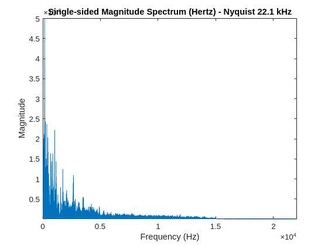

```matlab

figure(7)
plot(freq_hz(1:n_2), 10*log10(x_mag(1:n_2)))
xlabel('Frequency (Hz)')
ylabel('Magnitude');
title('Single-sided Magnitude spectrum (Hertz) - Nyquist 22.1 kHz');
axis tight
```

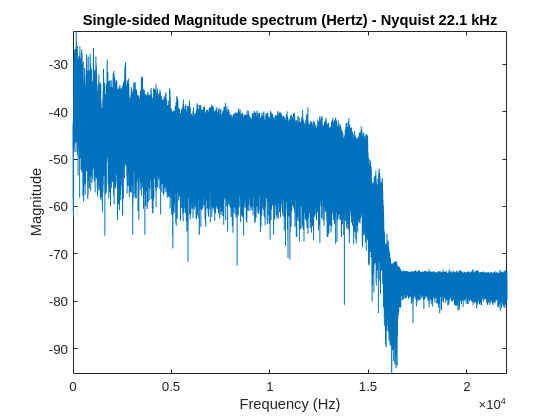

```matlab

%=================================================================%
nsamp_5 = length(music_by_5);
fnyquist_5 = Fs_by_5 / 2; % Correct Nyquist frequency
x_mag_5 = abs(fft(music_by_5)) / nsamp_5;
bins_5 = [0:nsamp_5-1];
freq_hz_5 = bins_5 * Fs_by_5 / nsamp_5;  % Use Fs_by_5 instead of Fs

% Only positive frequencies
n_2_5 = ceil(nsamp_5 / 2);
figure(8)
plot(freq_hz_5(1:n_2_5), x_mag_5(1:n_2_5));
xlabel('Frequency (Hz)')
ylabel('Magnitude');
title('Single-sided Magnitude Spectrum (Hertz) - Nyquist 4.41 kHz');
axis tight
```

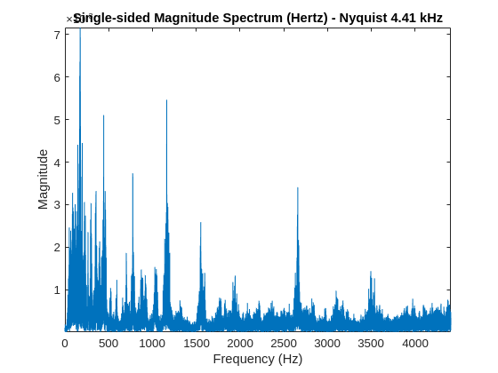

```matlab

figure(9)
plot(freq_hz_5(1:n_2_5), 10*log10(x_mag_5(1:n_2_5)))
xlabel('Frequency (Hz)')
ylabel('Magnitude');
title('Single-sided Magnitude spectrum (Hertz) - Nyquist 4.41 kHz');
axis tight
```

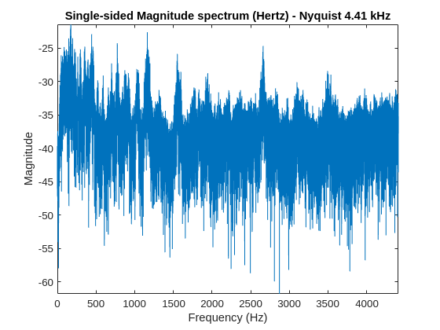

```matlab

%===============================================================%
%fs/15 frequency domain plot
nsamp_15 = length(music_by_15);
fnyquist_15 = Fs_by_15 / 2; % Correct Nyquist frequency
x_mag_15 = abs(fft(music_by_15)) / nsamp_15;
bins_15 = [0:nsamp_15-1];
freq_hz_15 = bins_15 * Fs_by_15 / nsamp_15;  % Use Fs_by_15 instead of Fs

% Only positive frequencies
n_2_15 = ceil(nsamp_15 / 2);
figure(10)
plot(freq_hz_15(1:n_2_15), x_mag_15(1:n_2_15));
xlabel('Frequency (Hz)')
ylabel('Magnitude');
title('Single-sided Magnitude Spectrum (Hertz) - Nyquist 1.47 kHz');
axis tight
```

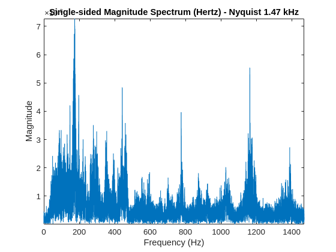

```matlab

figure(11)
plot(freq_hz_15(1:n_2_15), 10*log10(x_mag_15(1:n_2_15)))
xlabel('Frequency (Hz)')
ylabel('Magnitude');
title('Single-sided Magnitude spectrum (Hertz) - Nyquist 1.47 kHz');
axis tight
```

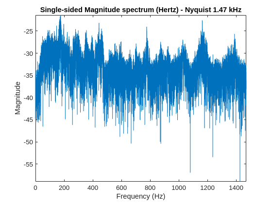

```matlab

%=====================================================================%
%fs/25 frequency domain plot
nsamp_25 = length(music_by_25);
fnyquist_25 = Fs_by_25 / 2; % Correct Nyquist frequency
x_mag_25 = abs(fft(music_by_25)) / nsamp_25;
bins_25 = [0:nsamp_25-1];
freq_hz_25 = bins_25 * Fs_by_25 / nsamp_25;  % Use Fs_by_25 instead of Fs

% Only positive frequencies
n_2_25 = ceil(nsamp_25 / 2);
figure(12)
plot(freq_hz_25(1:n_2_25), x_mag_25(1:n_2_25));
xlabel('Frequency (Hz)')
ylabel('Magnitude');
title('Single-sided Magnitude Spectrum (Hertz) - Nyquist 0.882 kHz');
axis tight
```

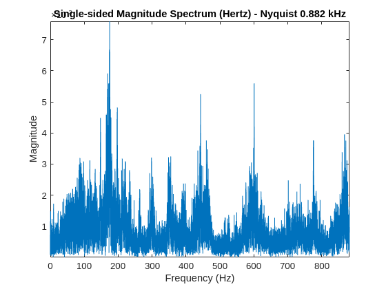

```matlab

figure(13)
plot(freq_hz_25(1:n_2_25), 10*log10(x_mag_25(1:n_2_25)))
xlabel('Frequency (Hz)')
ylabel('Magnitude');
title('Single-sided Magnitude spectrum (Hertz) - Nyquist 0.882 kHz');
axis tight
```

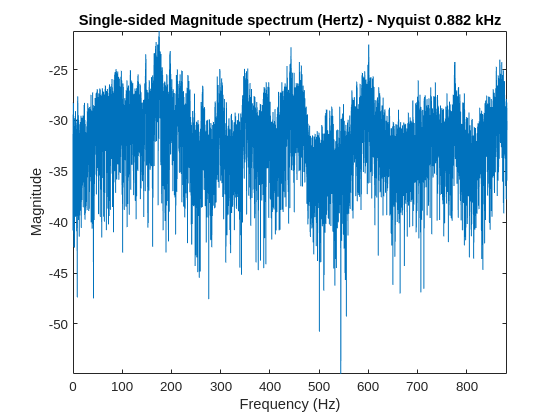


# **Part C \- Anti Aliasing Filters**
```matlab
% FilterDesign for music by 5 (Sample Freq 1.764 kHz, Nyquist 0.882 kHz)
% Cutoff frequency 700Hz
music_filtered = filtfilt(Num, 1, music_10s);
music_filt_by_25 = music_filtered(1:25:end);

```
# Part D \- A Mystery
```matlab
[mysterySound, Fs] = audioread('labs/lab1/2001_a_space_oddity.wav');

nsamp = length(mysterySound); % Number of samples
fnyquist = Fs / 2;            % Nyquist frequency
x_mag = abs(fft(mysterySound)) / nsamp;  % Magnitude of FFT
bins = [0:nsamp-1];
freq_hz = bins * Fs / nsamp;

% Only positive frequencies
n_2 = ceil(nsamp / 2);
figure(14)
plot(freq_hz(1:n_2), x_mag(1:n_2));
xlabel('Frequency (Hz)')
ylabel('Magnitude');
title('Single-sided Magnitude Spectrum (Hertz) - Original Signal');
axis tight
```

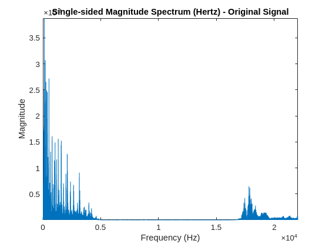

```matlab

figure(15)
plot(freq_hz(1:n_2), 10*log10(x_mag(1:n_2)))
xlabel('Frequency (Hz)')
ylabel('Magnitude');
title('Single-sided Magnitude Spectrum (Hertz) - Original Signal');
axis tight
```

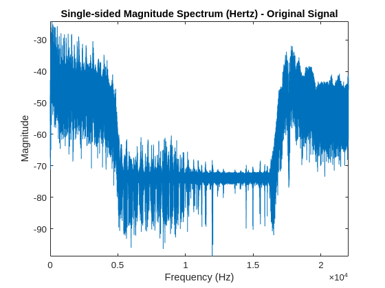

```matlab

%=====================================================================
% Downsample by 5
mysterySound_sub_5 = mysterySound(1:5:end);
Fs_by_5 = Fs / 5;  % New sampling rate

nsamp_5 = length(mysterySound_sub_5);
fnyquist_5 = Fs_by_5 / 2; % Nyquist frequency
x_mag_5 = abs(fft(mysterySound_sub_5)) / nsamp_5;
bins_5 = [0:nsamp_5-1];
freq_hz_5 = bins_5 * Fs_by_5 / nsamp_5;  % Corrected frequency axis

% Only positive frequencies
n_2_5 = ceil(nsamp_5 / 2);
figure(16)
plot(freq_hz_5(1:n_2_5), x_mag_5(1:n_2_5));
xlabel('Frequency (Hz)')
ylabel('Magnitude');
title('Single-sided Magnitude Spectrum (Hertz) - Nyquist 4.41kHz');
axis tight
```

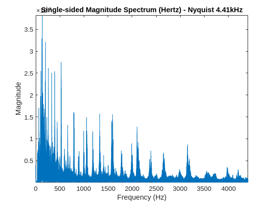

```matlab

figure(17)
plot(freq_hz_5(1:n_2_5), 10*log10(x_mag_5(1:n_2_5)))
xlabel('Frequency (Hz)')
ylabel('Magnitude');
title('Single-sided Magnitude Spectrum (Hertz) - Nyquist 4.41kHz');
axis tight
```

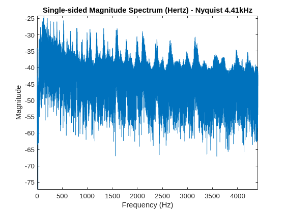


